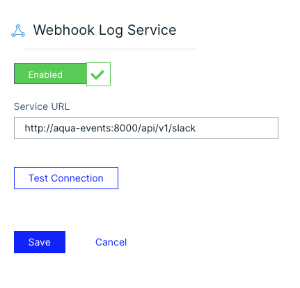
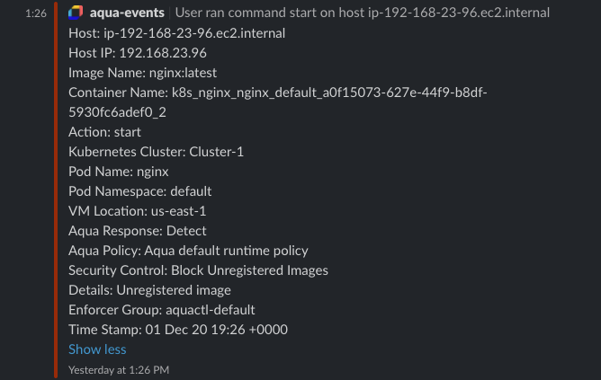

# Aqua Events

[](https://travis-ci.org/BryanKMorrow/aqua-events-go)
[](https://goreportcard.com/report/github.com/BryanKMorrow/aqua-events-go)

# Table of Contents

- [Abstract](#abstract)
- [Features](#features)
- [Quick Start](#quick-start)
  - [Aqua Integration](#aqua-integration)
  - [Docker](#docker)
  - [Kubernetes](#kubernetes)
- [Disclaimer](#disclaimer)

# Abstract
`Aqua Events` is an application that can receive all audit events from the Aqua Container Security Platform and forward those to Slack. 
> _Aqua Events is compatible with Aqua Cloud Native Security Platform 5.3_

# Features
- Accepts audit events via the Log Management webhook integration
  - Message Types - Success, Detect, Block, Alert
  - Formats the audit message to a Slack message attachment
  - Allows for the filtering of message types

# Quick Start

## Aqua Integration
- Navigate to the Log Management Integration page
  - Administration -> Integrations -> Log Management
- Select the Webhook integration
  - Enable the service, paste the URL to your aqua-events container service and test connection
  - If test is successful, save the integration, and you will start receiving audit events to Slack
  



## Docker

```sh
docker pull bkmorrow/aqua-events-go:latest
docker run --rm --name aqua-events -p 8000:8000 --env SLACK_WEBHOOK=https://slackwebhook.url --env IGNORE_LIST=success,detect bkmorrow/aqua-events-go:latest 
```

## Kubernetes
Modify the environment variables
* SLACK_WEBHOOK - This will be the URL to you receive from the Slack App
* IGNORE_LIST - This is a comma separated list of event categories to ignore (alert,success,detect,block)
```
kubectl apply -f kubernetes/aqua-events.yaml
```

# License
This repository is available under the [GNU Affero General Public License v3.0](https://github.com/BryanKMorrow/aqua-events-go/blob/main/LICENSE)

# Author
[Bryan Morrow](https://github.com/BryanKMorrow) (BryanKMorrow)  

# Disclaimer
> THE SOFTWARE IS PROVIDED "AS IS", WITHOUT WARRANTY OF ANY KIND, EXPRESS OR IMPLIED, INCLUDING BUT NOT LIMITED TO THE WARRANTIES OF MERCHANTABILITY, FITNESS FOR A PARTICULAR PURPOSE AND NONINFRINGEMENT. IN NO EVENT SHALL THE AUTHORS OR COPYRIGHT HOLDERS BE LIABLE FOR ANY CLAIM, DAMAGES OR OTHER LIABILITY, WHETHER IN AN ACTION OF CONTRACT, TORT OR OTHERWISE, ARISING FROM, OUT OF OR IN CONNECTION WITH THE SOFTWARE OR THE USE OR OTHER DEALINGS IN THE SOFTWARE. 
